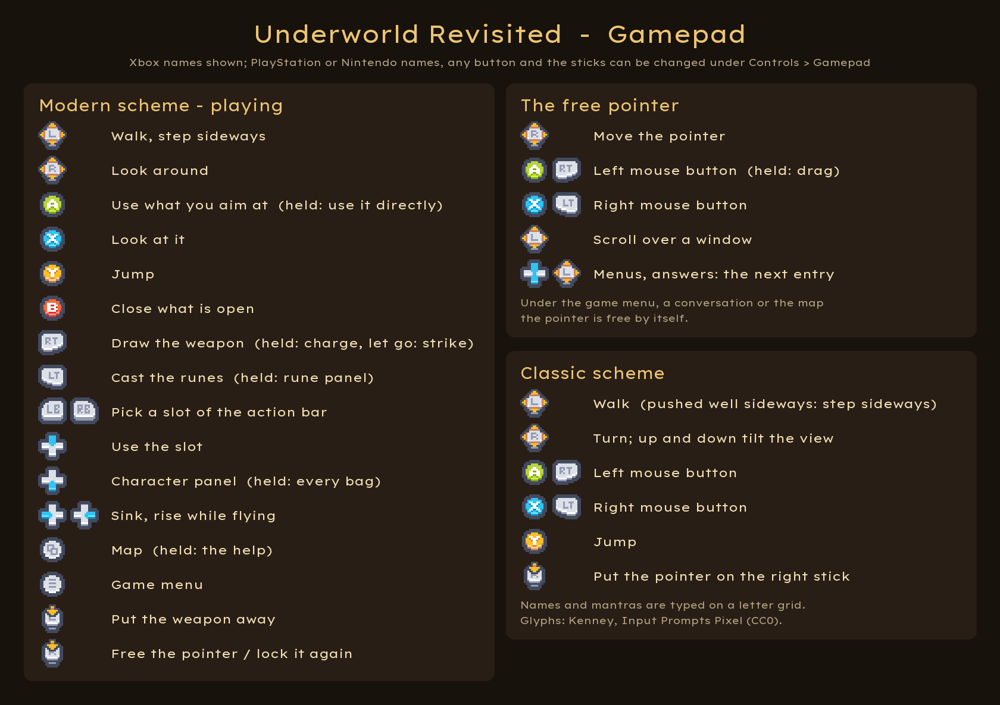

# Controls

The full controls of [Underworld Revisited](../README.md).

- [The original scheme](#the-original-scheme)
- [The modern scheme](#the-modern-scheme)
- [Gamepad](#gamepad)
- [Motion](#motion)

Two schemes, both complete. **Shift+F2** switches between them at any time - or, without a key,
*Original* and *Modern* under *Game* in the menu bar - and the scheme
in force is kept for the next start. The help window's **Controls** tab lists the keys of the
scheme in force, as you have bound them; keys and mouse buttons can be changed under
*Controls* in the menu bar at the top edge.

## The original scheme

As in 1992: the mouse pointer is visible and steers the walking.

| | |
|---|---|
| Hold the left mouse button in the view | Walk. Where the pointer sits decides direction and speed, and the pointer's shape shows it, as in the original |
| Left mouse button, dragging an object | Pick it up and carry it on the pointer - to the inventory, to another spot, or onto something else to use it there |
| Right mouse button, short click | Look at whatever is under the pointer |
| Right mouse button, held and moved | Use it: open a door, throw a lever, drink from a fountain |
| W, S | Forward, backward |
| A, D | Turn left, right |
| The two keys next to X | Step sideways |
| J or Space | Jump |
| 1, 2, 3 | Look down, straight ahead, up |
| Q, E | Sink, rise - while hovering or flying |
| F1 to F6 | Options, talk, get, look, fight, use - the command icons, as in the original |
| F7 | Turn the panel between inventory and character |
| F8 | Cast the runes on the shelf |
| F10 | Make camp |
| Tab | The help window: spells, mantras, own notes and the game's manual (not with Alt, so Alt+Tab to another program leaves it alone) |
| Ctrl+S, R, M, F, D, Q | Save, restore, music, sound, detail, quit - the options shortcuts of the original |
| M, F | The map (with a map in the pack), the modern font |

Combat mode is started as in the original, by clicking the weapon on the paperdoll. Where in
the view you press then decides the blow - upper third bash, middle slash, lower third
stab - and the longer you hold, the stronger it lands.

## The modern scheme

The port's own: the mouse turns the view, a crosshair aims, and an interface
of its own replaces the classic frame - an action bar, a minimap, bags in the manner of
today's role-playing games, a character panel and a rune panel that slide out from the
screen's edges. The rules are the original's throughout; only the way to them is new.

| | |
|---|---|
| Mouse | Look around (the pointer locked, a crosshair in the middle) |
| Right mouse button | Free the pointer for the windows, or lock it again. The game menu has the other way round as an option: the pointer stays free and the view turns while the button is held |
| W, A, S, D | Walk, step sideways |
| Space | Jump; rise while hovering or flying |
| Left Ctrl | Sink while hovering or flying |
| E | The usual thing for what you aim at: pick it up, talk, open, use. Held: use it directly |
| | With the pointer free over a bag, the character panel or the action bar, Q and E act on the thing under the pointer: Q looks at it, E opens a bag, puts on what is worn or uses it (holding E does nothing there) |
| Q | Look at it |
| R | Draw or put away the weapon. Then hold the left button to charge and let go to strike: with the pointer locked the view's height chooses the blow (up bash, straight slash, down thrust), with it free the original's thirds of the screen |
| 1 ... 0 | The action bar: things and spells dragged onto it |
| B, C | The bags, the character panel |
| Z (the key left of X) | The rune panel: the rune shelf and every spell, castable from there or from the action bar |
| M | The big map, as the original's (with a map in the pack) |
| Tab | The help, in the character panel - with the Controls tab |
| F9, F10 | Track, make camp - also the boots and the bedroll beside the paperdoll's feet |
| Escape | Close what is open, then the game menu |
| Right Ctrl+S, R | Save, restore |

With the pointer free, a left click on a thing in the world opens its menu (talk, use, look,
pick up) and dragging takes it. In the bags the left button takes and puts down, the right
button opens a thing's menu, and Shift with the left button splits a stack. Conversations
get a screen of their own: the history readable on leather, the answers by number or click,
the trade by dragging from the bags. Questions of the game - a repair, a mantra - come as a
box with OK and Cancel while the world stands still.

**Edit layout** in the game menu: every part of the modern interface - action bar, minimap,
heading, active spells, messages, vitality and mana, bags, the two panels and the conversation -
can be moved and sized there, and the UI size as a whole is set there too. The panels slide
out from their edges while they stay there, and become free windows once moved. The minimap
can be switched off.

The modern scheme uses the whole screen. What belongs to the original's picture keeps it:
the big map shows the original's full-screen map at 4:3 with dark bars at the sides, and the
cutscenes in the view play in a frame in the middle.

## Gamepad

In both schemes, tested with an Xbox controller on Windows and on Linux. The buttons
as an Xbox pad names them; under *Controls* in the menu bar, its Gamepad tab, the names and glyphs
can be switched to PlayStation or Nintendo, every button bound anew, the sticks swapped (for the
left-handed), the look inverted, and each stick given a deadzone of its own against drift.
The help's Controls tab shows the buttons in force as glyphs.

| Modern scheme | |
|---|---|
| Left stick | Walk, step sideways |
| Right stick | Look around |
| A | The usual thing for what you aim at; held: use it directly |
| X | Look at it |
| Y | Jump |
| B | Close what is open |
| RT | Draw the weapon; held: charge, let go to strike |
| LT | Cast the runes in the hollow; held: the rune panel |
| LB, RB | Pick a slot of the action bar; D-pad up uses it |
| D-pad down | The character panel; held: every bag |
| D-pad left, right | Sink, rise while hovering or flying |
| View | The map; held: the help |
| Start | The game menu |
| L3 | Put the weapon away |
| R3 | Free the pointer (it appears on the backpack) or lock it again |

With the pointer free the pad is the mouse: the right stick moves the pointer, A and RT are
the left button (held: drag), X and LT the right one, and the left stick scrolls while the
pointer is on a window. In a menu - the game menu, a thing's menu - the d-pad and the left stick
step from entry to entry. Under a window that holds the game, such as the menu, a conversation
or the map, the pointer is free by itself. Names, save games and mantras are typed on a letter
grid that comes up by itself; the count of a stack turns on the d-pad, the answers of a
conversation step on the d-pad and the left stick. While the pad is in use, its buttons show at
the crosshair - what A does with what you aim at, X to look - and at the action bar; the hints
can be switched off in the Gamepad tab.

In the *original scheme* the left stick walks (pushed well sideways it steps sideways), the
right stick turns and tilts the view a step, A and RT are the left mouse button and X and LT
the right one wherever the pointer is, Y jumps, and R3 puts the pointer on the right stick.

## Motion

The player, the creatures and everything thrown or shot move by the original's own motion
code, transcribed from `UW.EXE` into the engine-free layer: the same units (a tile is 256
fine units, the clock 256 ticks a second), the same speeds, the same rules at walls, steps,
ledges, doors and water. How that code is run is a choice, under *Motion* in the menu bar,
which folds out over the main menu and, since the player is on this code, over the game menu
of the modern scheme and the options panel of the classic one.

- **Motion: Original or Smooth.** Original runs the original's arithmetic call by call,
  including its rounding, at the frame rate chosen below. Smooth runs the same rules without
  the rounding: the fraction below one unit is kept, the ramps run per second, and the game
  computes the motion once per rendered frame with the time that frame took, so the picture is
  even and the speeds are the same at every frame rate. Smooth is the default; players who get
  motion sick are the reason it exists.
- **Response** (Smooth): how long starting and stopping take - 0.6 s is the original on a slow
  PC, 0.3 s on the PC that DOSBox at 30000 cycles stands for.
- **Picture** (Original): Even draws the view between two calls; Stepped shows it only when a
  call has run, the picture of an old PC.
- **Original fps** (Original): how often per second the original's code runs - 64, 32, 21 or
  16. More is not faster: the original rounds down after every call, so with more calls a
  second the slow motions get slower. That is the long-known DOSBox quirk that at unlimited
  cycles one can hardly swim or walk backwards in the original, reproduced here down to the
  numbers: swimming moves 0.96 fine units a tick, which a call of one tick rounds to nothing.
  32 matches the original in DOSBox at 30000 cycles.
- **Head bob** and **Weapon**: the bobbing of the view and the weapon while walking - like the
  original, smoothed with a strength of your own, or off.

