# Underworld Revisited

An open-source reimplementation of **Ultima Underworld: The Stygian Abyss** (1992) in Unity,
built on the original game data. The goal is full gameplay parity with the original, plus an
optional modern render mode. Support for Ultima Underworld II is planned for later.

**You need your own copy of Ultima Underworld - the GOG.com version** ("Ultima Underworld
1+2"); other releases are not supported (see Requirements). This repository contains no game
data: no graphics, sounds, texts, maps or executables of the original. Everything is read at
runtime from your installation. The only exception are the screenshots below, which show the
original's artwork.

**To play, download the latest release** for Windows or Linux from the
[Releases page](https://github.com/PQMarine/UnderworldRevisited/releases) - see Installation.

This project is not affiliated with or endorsed by the owners of the Ultima Underworld
rights. Ultima and Ultima Underworld are trademarks of their respective owners. Underworld
Revisited is a free, non-commercial fan project: it is not sold, and no donations are accepted.

## Screenshots

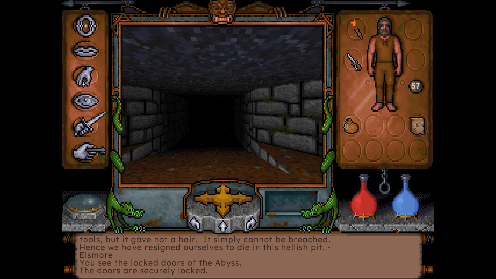

*The classic interface at 4:3, Palette mode, with the modern font.*

| Palette mode | Remastered mode |
|---|---|
| 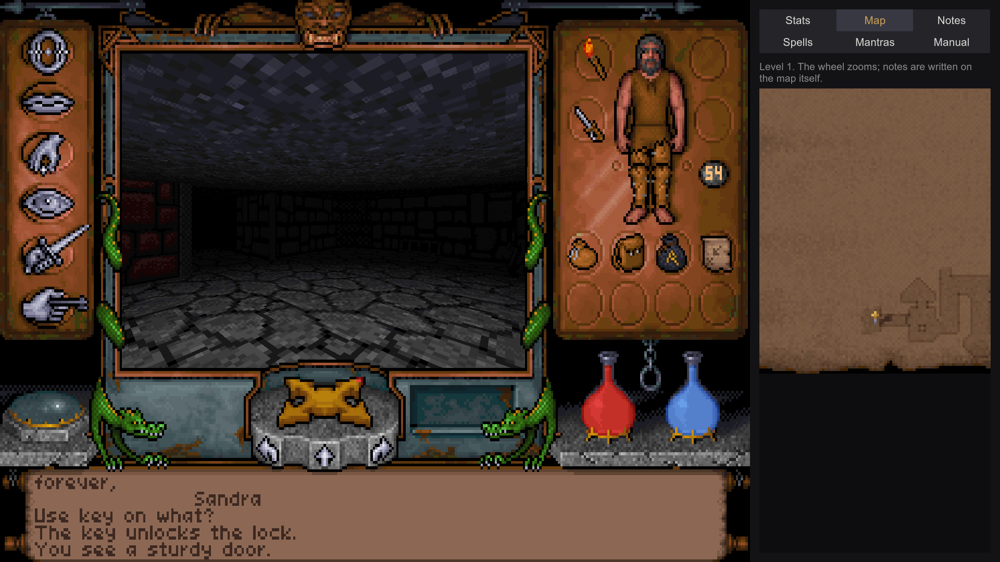 | 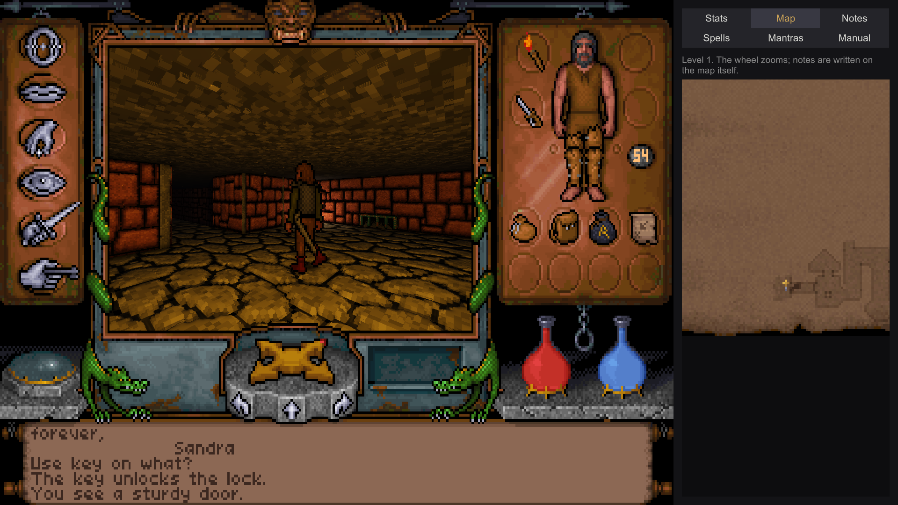 |
| *Light computed like the original, the help window beside the view with a live map.* | *The same spot lit by URP, with relief and glow.* |

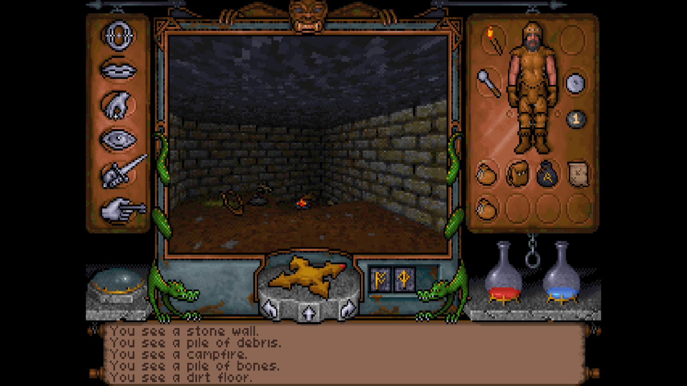

*The world at the original's resolution: one pixel row per row of the 320x200 screen, scaled
up with hard edges, while the frame, the paperdoll and the messages stay sharp.*

| Palette mode, full screen | Remastered mode, full screen |
|---|---|
| 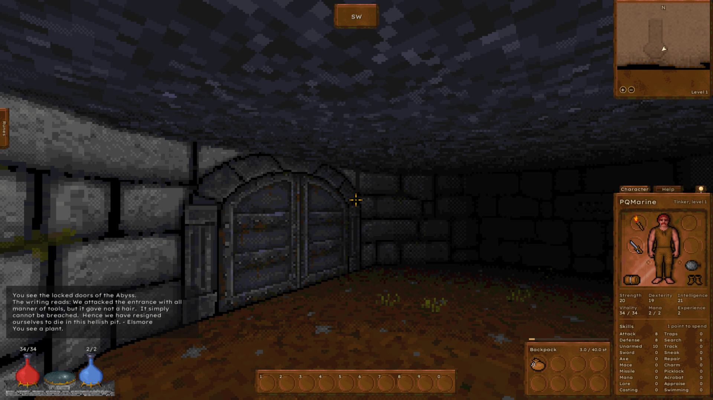 | 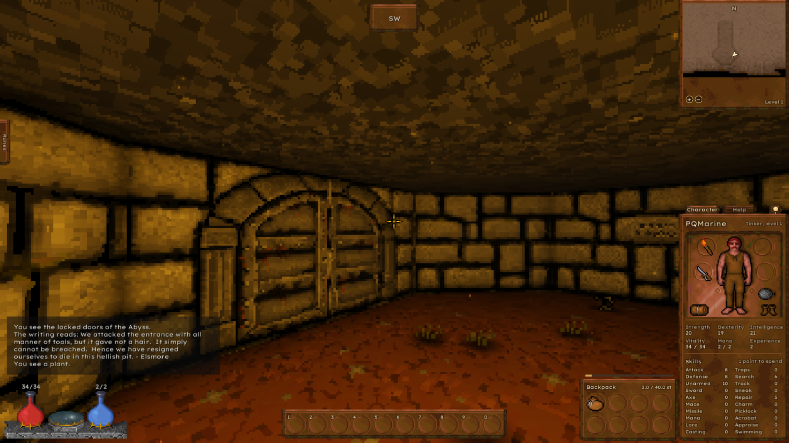 |
| *The modern scheme at the original's resolution: 200 rows, the width following the screen.* | *The same spot in Remastered mode, lit by the torch, at the same resolution.* |

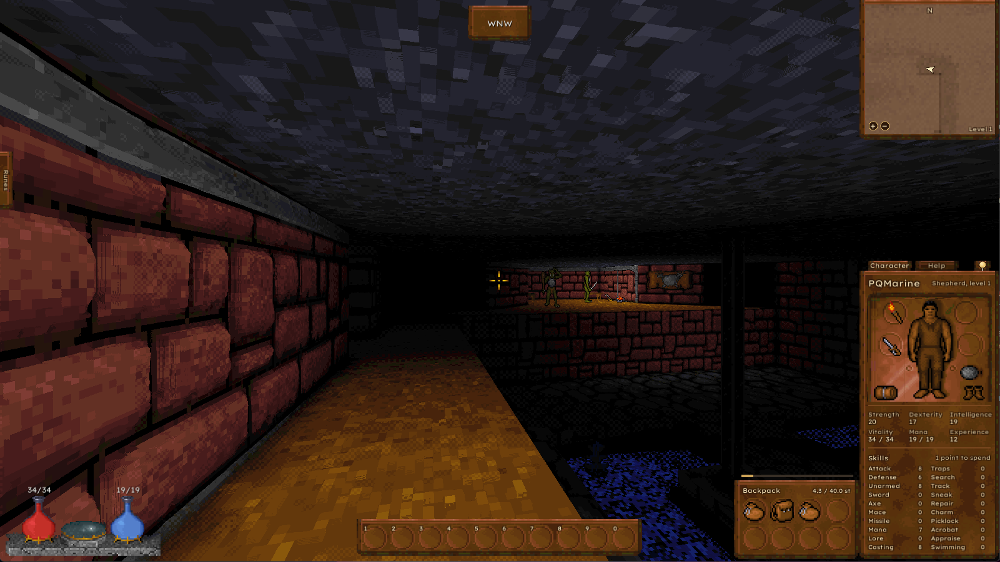

*Palette mode with its effects at Full: wall depth, darker joints and grime along the walls, the
campfire lighting the room across the water by the original's own light table - every pixel
still a colour of the original's palette.*

| Original font | Modern font |
|---|---|
| 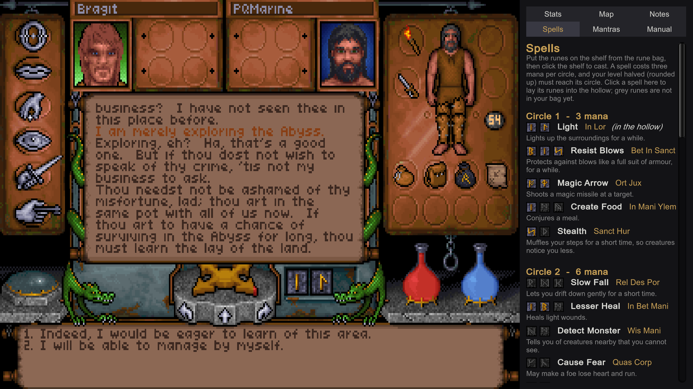 | 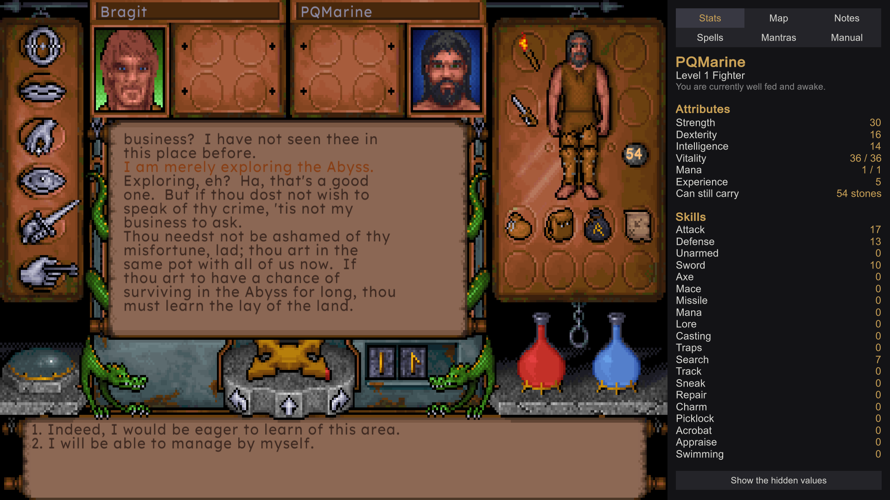 |
| *A conversation, and the spells the character knows.* | *The same conversation, and the character's stats.* |

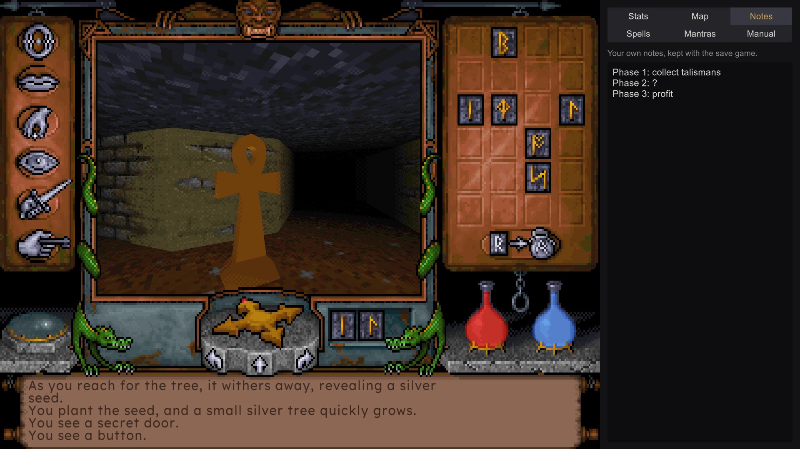

*The rune shelf, a shrine, and the player's own notes in the help window.*

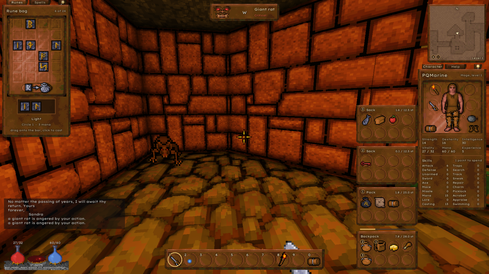

*The modern control scheme: the rune panel at the left, the character panel and the bags at
the right, the action bar below - and at the top the gargoyle's eyes after a blow on a giant
rat.*

| Spells and bags | Conversation |
|---|---|
| 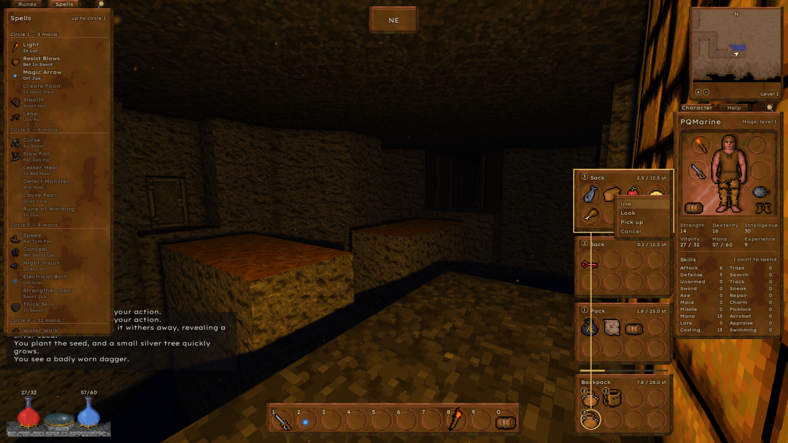 | 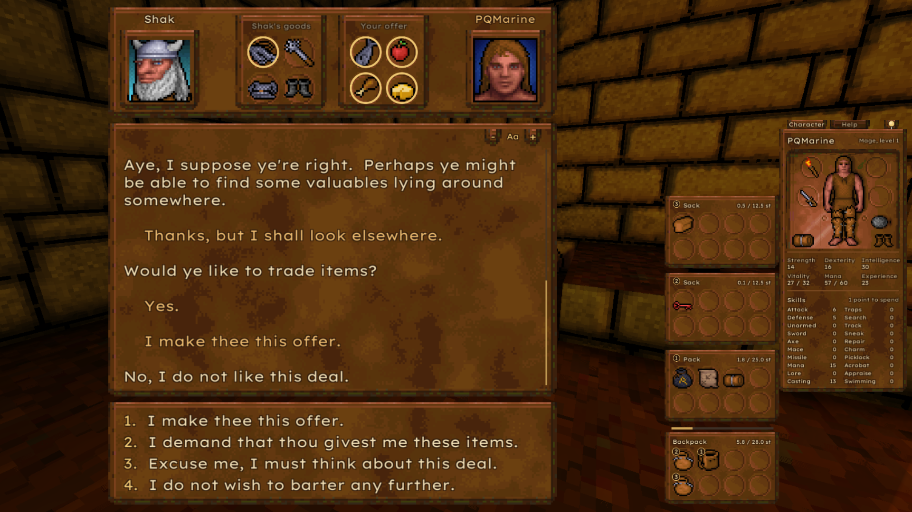 |
| *Every rune spell by circle, and a thing's menu in the bags, its window joined to its slot.* | *Trading with Shak: the marked goods ringed in gold, the bags beside the conversation.* |

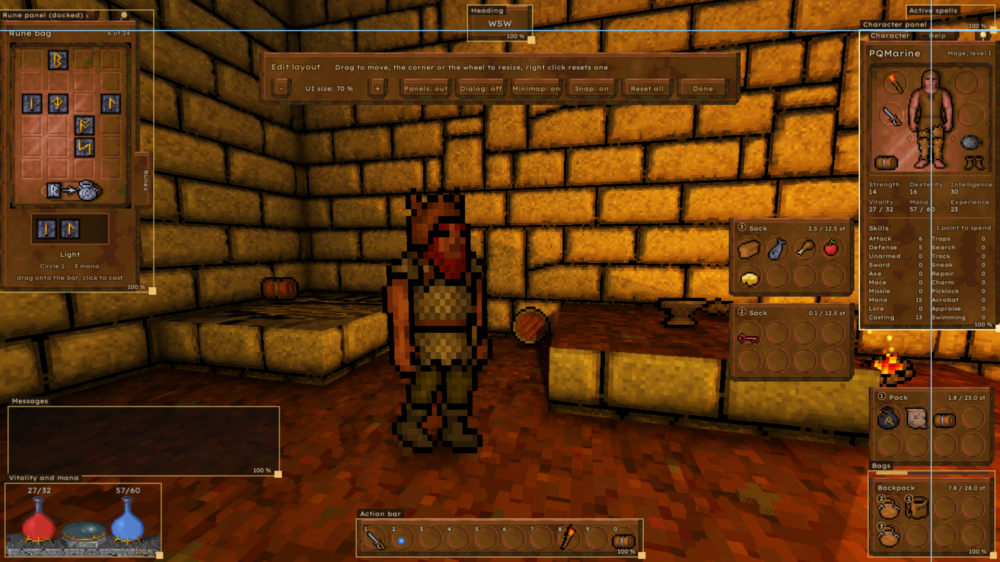

*The layout editor: every part of the modern interface framed, to be moved and sized.*

The screenshots show the artwork of the original game, which belongs to the owners of the
Ultima Underworld rights. It is shown for illustration only and is not covered by this
project's licence.

## State

Built and largely confirmed against the original: the world and its objects, combat,
conversations and trading, traps and triggers, spells, character creation, saving and
loading (compatible with the original's save games), the main menu, cutscenes, AdLib music
and sound effects through an OPL2 emulation, and the classic interface. The whole game has
been played through from character creation to the end sequence. Open points are listed in
[ROADMAP.md](ROADMAP.md).

What is in:

- The nine dungeon levels with their objects, doors, locks, traps and triggers
- Two render modes: **Palette** computes light like the original through SHADES.DAT and
  LIGHT.DAT, **Remastered** lights with URP and adds relief, specular highlights, glow,
  shadows and torch lights - each of them switchable on its own, so the plain modern look is
  just all of them turned off
- Effects of the port's own for the Palette mode that keep every pixel a colour of the
  original's palette - they only move the original's shade steps: ambient occlusion, grime
  where walls meet the floor (in a dirt, moss or soot colour), wall depth (parallax) with its
  shadow, darker joints, ground shadows under creatures and things, glowing lava and flames,
  and light sources - torches, fires, lava, glowing stones - lighting their surroundings by the
  original's own light table, walls casting shadows. Off by default, with the presets Subtle
  and Full (Graphics menu, Palette effects...); the grime works in the Remastered mode too.
  Use them with care: turned up, they quickly take away the look of the original
- The 3D models (barrel, chest, chair, shrine, bridge, portcullis ...) read from `UW.EXE`
- Combat with the original's tables, magic with runes, and the creatures with their goals,
  attitudes and group alarm
- Conversations, running the original conversation bytecode, including trading
- Character creation, inventory and paperdoll, automap, sleeping, hunger and fatigue, the
  endgame with talismans and the void
- Save games compatible with the original's, in `UNDEROM1\SAVE1` to `SAVE4`
- Intro, dreams and the end sequence from the original's cutscene files, with speech
- AdLib music and sound effects through an OPL2 emulation (a C# port of the YM3812 core of
  Aaron Giles' [ymfm](https://github.com/aaronsgiles/ymfm), see THIRD_PARTY_NOTICES.md)
- Two control schemes: the original's mouse-pointer steering, and a modern scheme of the
  port's own with free mouse look, WASD, an action bar and an interface built from the
  original's artwork (see Controls)
- The motion of the player, the creatures and thrown things as the original's own code,
  with a choice between its arithmetic call by call and a precise, frame-rate independent
  computation of the same rules (see Motion under Controls)
- Additions of the port's own, each optional: a help window beside the view (stats with the
  hidden values, a live map, notes kept with the save game, spells, mantras and the game's
  manual), a modern readable font, the original's 4:3 frame on wide screens, the world at the
  original's resolution or a multiple of it up to 4x, with sharp pixels while the interface
  stays sharp (Graphics menu; 200 rows full screen at 1x, the width following the screen), and dealing the attribute points at
  character creation yourself instead of rolling them

## Requirements

- **Windows** 10 or newer (64-bit) with a DirectX 11 graphics card. It is the system the port
  is developed and tested on.
- **Linux** (64-bit, x86-64, Vulkan or OpenGL 4): part of every release since 0.3.0, tested
  in a Kubuntu virtual machine and far less than the Windows version. The game folder is
  searched in the usual Linux homes of a GOG game (see Building) and can be chosen by hand.
  macOS is untried. Reports from other systems are welcome.
- Unity **6000.6.0f1** (Unity 6), Universal Render Pipeline - only to build it yourself
- **Ultima Underworld 1 from GOG.com** ("Ultima Underworld 1+2"). Only this version is
  supported: some data (3D models, their colours) is read directly from the game's executable
  at build-specific offsets, verified against the GOG `UW.EXE` (547,248 bytes). Other
  releases (original floppy, CD, other stores) may differ and are not supported.

## Installation

First install Ultima Underworld from GOG.com ("Ultima Underworld 1+2"). Then either of these:

### A release (to play)

1. Download the latest release from the
   [Releases page](https://github.com/PQMarine/UnderworldRevisited/releases):
   `UnderworldRevisited-<version>-win64.zip` for Windows or
   `UnderworldRevisited-<version>-linux64.tar.gz` for Linux.
2. Unpack it into a folder of its own.
3. Start `UR.exe` (Windows) or `UR.x86_64` (Linux). Should Linux refuse to run it, the
   executable bit got lost on the way: `chmod +x UR.x86_64` in that folder, once.
4. The game looks for your GOG installation in the usual places (listed under Building). If
   it does not find it, it asks for the folder: choose the one that contains `game.gog`. The
   choice is remembered and can be changed later in the menu bar of the main menu
   (*Game > Game folder...*).

Nothing else needs to be installed; the package brings its own runtime. Its `README.txt` is
the short version of this file for players.

### From source (to build it yourself)

1. Clone the repository and open the folder with Unity 6000.6.0f1.
2. Select `Assets/Resources/UWSettings.asset` and set **GogInstallPath** to your GOG
   installation folder (the folder containing `game.gog`), or to `game.gog` itself. Common
   installation folders are found automatically when the field is empty.
3. Open `Assets/UW.unity` and press Play, or build a player (see Building).

### The game data

In the GOG release the game data is not installed as separate files but kept in `game.gog`, a
CD image. On the first start the Ultima Underworld 1 files (`CRIT`, `CUTS`, `DATA`, `SOUND`,
`UW.EXE`) are extracted from it once into a local cache folder; nothing is written to the
installation. Save games are read from and written to the installation's `UNDEROM1\SAVE1` to
`SAVE4`, so they can be exchanged with the original game. Built from source, the settings
asset's **SavegameFolder** overrides that location, and its **DataPath** can point to an
already extracted `DATA` folder instead.

## Controls

Two schemes, both complete. **Shift+F2** switches between them at any time, and the scheme
in force is kept for the next start. The help window's **Controls** tab lists the keys of the
scheme in force, as you have bound them; keys and mouse buttons can be changed under
*Controls* in the menu bar at the top edge.

*Original scheme* - as in 1992: the mouse pointer is visible and steers the walking.

| | |
|---|---|
| Hold the left mouse button in the view | Walk. Where the pointer sits decides direction and speed, and the pointer's shape shows it, as in the original |
| Left mouse button, dragging an object | Pick it up and carry it on the pointer - to the inventory, to another spot, or onto something else to use it there |
| Right mouse button, short click | Look at whatever is under the pointer |
| Right mouse button, held and moved | Use it: open a door, throw a lever, drink from a fountain |
| W, S | Forward, backward |
| A, D | Turn left, right |
| The two keys next to X | Step sideways |
| J or Space | Jump |
| 1, 2, 3 | Look down, straight ahead, up |
| Q, E | Sink, rise - while hovering or flying |
| F1 to F6 | Options, talk, get, look, fight, use - the command icons, as in the original |
| F7 | Turn the panel between inventory and character |
| F8 | Cast the runes on the shelf |
| F10 | Make camp |
| Tab | The help window: spells, mantras, own notes and the game's manual (not with Alt, so Alt+Tab to another program leaves it alone) |
| Ctrl+S, R, M, F, D, Q | Save, restore, music, sound, detail, quit - the options shortcuts of the original |
| M, F | The map (with a map in the pack), the modern font |

Combat mode is started as in the original, by clicking the weapon on the paperdoll. Where in
the view you press then decides the blow - upper third bash, middle slash, lower third
stab - and the longer you hold, the stronger it lands.

*Modern scheme* - the port's own: the mouse turns the view, a crosshair aims, and an interface
of its own replaces the classic frame - an action bar, a minimap, bags in the manner of
today's role-playing games, a character panel and a rune panel that slide out from the
screen's edges. The rules are the original's throughout; only the way to them is new.

| | |
|---|---|
| Mouse | Look around (the pointer locked, a crosshair in the middle) |
| Right mouse button | Free the pointer for the windows, or lock it again. The game menu has the other way round as an option: the pointer stays free and the view turns while the button is held |
| W, A, S, D | Walk, step sideways |
| Space | Jump; rise while hovering or flying |
| Left Ctrl | Sink while hovering or flying |
| E | The usual thing for what you aim at: pick it up, talk, open, use. Held: use it directly |
| | With the pointer free over a bag, the character panel or the action bar, Q and E act on the thing under the pointer: Q looks at it, E opens a bag, puts on what is worn or uses it (holding E does nothing there) |
| Q | Look at it |
| R | Draw or put away the weapon. Then hold the left button to charge and let go to strike: with the pointer locked the view's height chooses the blow (up bash, straight slash, down thrust), with it free the original's thirds of the screen |
| 1 ... 0 | The action bar: things and spells dragged onto it |
| B, C | The bags, the character panel |
| Z (the key left of X) | The rune panel: the rune shelf and every spell, castable from there or from the action bar |
| M | The big map, as the original's (with a map in the pack) |
| Tab | The help, in the character panel - with the Controls tab |
| F9, F10 | Track, make camp - also the boots and the bedroll beside the paperdoll's feet |
| Escape | Close what is open, then the game menu |
| Right Ctrl+S, R | Save, restore |

With the pointer free, a left click on a thing in the world opens its menu (talk, use, look,
pick up) and dragging takes it. In the bags the left button takes and puts down, the right
button opens a thing's menu, and Shift with the left button splits a stack. Conversations
get a screen of their own: the history readable on leather, the answers by number or click,
the trade by dragging from the bags. Questions of the game - a repair, a mantra - come as a
box with OK and Cancel while the world stands still.

**Edit layout** in the game menu: every part of the modern interface - action bar, minimap,
heading, active spells, messages, vitality and mana, bags, the two panels and the conversation -
can be moved and sized there, and the UI size as a whole is set there too. The panels slide
out from their edges while they stay there, and become free windows once moved. The minimap
can be switched off.

The modern scheme uses the whole screen. What belongs to the original's picture keeps it:
the big map shows the original's full-screen map at 4:3 with dark bars at the sides, and the
cutscenes in the view play in a frame in the middle.

### Motion

The player, the creatures and everything thrown or shot move by the original's own motion
code, transcribed from `UW.EXE` into the engine-free layer: the same units (a tile is 256
fine units, the clock 256 ticks a second), the same speeds, the same rules at walls, steps,
ledges, doors and water. How that code is run is a choice, under *Motion* in the menu bar,
which folds out over the main menu and, since the player is on this code, over the game menu
of the modern scheme and the options panel of the classic one.

- **Motion: Original or Smooth.** Original runs the original's arithmetic call by call,
  including its rounding, at the frame rate chosen below. Smooth runs the same rules without
  the rounding: the fraction below one unit is kept, the ramps run per second, and the game
  computes the motion once per rendered frame with the time that frame took, so the picture is
  even and the speeds are the same at every frame rate. Smooth is the default; players who get
  motion sick are the reason it exists.
- **Response** (Smooth): how long starting and stopping take - 0.6 s is the original on a slow
  PC, 0.3 s on the PC that DOSBox at 30000 cycles stands for.
- **Picture** (Original): Even draws the view between two calls; Stepped shows it only when a
  call has run, the picture of an old PC.
- **Original fps** (Original): how often per second the original's code runs - 64, 32, 21 or
  16. More is not faster: the original rounds down after every call, so with more calls a
  second the slow motions get slower. That is the long-known DOSBox quirk that at unlimited
  cycles one can hardly swim or walk backwards in the original, reproduced here down to the
  numbers: swimming moves 0.96 fine units a tick, which a call of one tick rounds to nothing.
  32 matches the original in DOSBox at 30000 cycles.
- **Head bob** and **Weapon**: the bobbing of the view and the weapon while walking - like the
  original, smoothed with a strength of your own, or off.

## Building

Open the project with Unity 6000.6.0f1 and build it from Unity's build window
(`File > Build Profiles` in Unity 6), target Windows or Linux (the Linux Build Support (Mono)
module of the Hub). There is nothing else to prepare: the whole game is built from
`Assets/UW.unity`, and the settings asset in `Assets/Resources` travels with it. In batch
mode:

```
Unity.exe -batchmode -quit -nographics -projectPath <project> -buildWindows64Player <project>\Build\UR.exe
Unity.exe -batchmode -quit -nographics -projectPath <project> -buildTarget Linux64 -buildLinux64Player <project>\Build\Linux\UR.x86_64
```

The built game finds the game data the same way the editor does. If **GogInstallPath** is
empty, these folders are searched in this order:

```
C:\GOG Games\Ultima Underworld
D:\GOG Games\Ultima Underworld
C:\Program Files (x86)\GOG Galaxy\Games\Ultima Underworld
C:\Program Files (x86)\GOG.com\Ultima Underworld
C:\Ultima Underworld
D:\Ultima Underworld
```

On Linux the same role falls to `~/GOG Games/Ultima Underworld` and `~/GOG Games/Ultima
Underworld 1+2`, `~/Games/Ultima Underworld`, Heroic's `~/Games/Heroic/Ultima Underworld 1+2`,
Lutris' `~/Games/gog/ultima-underworld-1-2`, and the same `GOG Games` folder inside
`~/.wine/drive_c` and the Steam Proton `compatdata` prefixes. What is looked for is the folder
with `game.gog`, the CD image every GOG release carries.

So a build made on one machine runs on another as long as the game is installed in one of
them. To be sure your copy works, run the self-check below before building.

To pack a build for others, run `Tools\Release\MakeReleaseZip.ps1` (Windows PowerShell). It
writes `Release\UnderworldRevisited-<version>-win64.zip` with the player, LICENSE,
THIRD_PARTY_NOTICES.md and the full licence texts of the `ThirdParty` folder (their notices
have to travel with the binary), this README and a short README.txt for players - and without Unity's `*_BackUpThisFolder_ButDontShipItWithYourGame`
folder. With `-Platform linux64` it packs `Build\Linux` into
`UnderworldRevisited-<version>-linux64.tar.gz`, the launcher with its executable bit (GNU tar
of Git for Windows; without it a zip, and the player has to `chmod +x`). It refuses a build
that holds anything looking like original game data.

## The engine-free layer

Everything that reads and interprets the original data lives in `Assets/UWDataImport` and
knows nothing about any game engine: file formats, strings and conversations, object and
critter tables, the OPL2 emulation for music and sound effects, the cutscene decoder, the
3D models from `UW.EXE`, and a growing part of the game rules. Unity enforces this - the
assembly definition sets `noEngineReferences`, so a single `using UnityEngine` in there
fails to compile.

`Core/UWDataImport.csproj` builds exactly those sources with the plain .NET SDK, without
Unity, as a .NET Standard 2.1 library. Two small command line programs run on top of it.

`Tools/UWSelfCheck` reads a complete installation once and reports what came through -
levels, strings, textures, the 3D models from `UW.EXE`, cutscenes and sound. Use it to find
out whether your copy of the game works with this port before starting Unity at all:

```
dotnet run --project Tools/UWSelfCheck -- "C:\GOG Games\Ultima Underworld 1"
```

```
Data folder: C:\Users\...\Temp\UnderworldRevisited\UW1\DATA

  OK   load       151 ms
  OK   levels     9 levels, 4101 objects in tiles
  OK   strings    122 blocks, 11106 strings
  OK   textures   818 pictures in 6 kinds
  OK   models     26 models with 484 faces, UW.EXE is the supported build
  OK   cutscenes  47 files, 1210 frames
  OK   sound      24 effects, 12 music pieces with 6690 notes
```

`Tools/UWDump` prints single pieces of the data:

```
dotnet run --project Tools/UWDump -- info   "C:\GOG Games\Ultima Underworld 1"
dotnet run --project Tools/UWDump -- level  <path> 1 3 50 6
dotnet run --project Tools/UWDump -- object <path> 349
dotnet run --project Tools/UWDump -- find   <path> lockpick
```

The path is a `DATA` folder, a GOG installation folder or `game.gog` itself. The tool is
handy for looking things up, and it keeps the claim honest: if the layer ever grew an
engine dependency, this build would break.

Input, camera, movement, collision, rendering and audio output stay on the Unity side. The
long-term plan is to move more rules across the line, so the game logic can be reused
without Unity.

## How this was made

I have been a fan of Ultima Underworld ever since it came out in 1992. In 2012 I came
across uw-formats.txt, a text file describing the game's data formats, more or less by
chance, and thought: why not give it a try? That was the start of this project, but I
never had the time or the experience to take it further. In 2026, with the help of Claude
(Anthropic's AI model, via Claude Code), I picked it up again. Since then the code has
been written by Claude; I decided what to build, tested every behaviour against the
original game and confirmed or rejected the results.

### Thanks

This project would not be where it is without **hankmorgan**'s work. His
[UWReverseEngineering](https://github.com/hankmorgan/UWReverseEngineering) project, a
disassembly of `UW.EXE` with named routines and a large guide to the game's mechanics, is
where most of the rules here were read from: the motion code, the creature AI, traps,
magic and much more. His [UnderworldGodot](https://github.com/hankmorgan/UnderworldGodot),
a recreation of both Underworld games, provided many formulas and data tables (see
[THIRD_PARTY_NOTICES.md](THIRD_PARTY_NOTICES.md)), and his earlier
[UnderworldExporter](https://github.com/hankmorgan/UnderworldExporter) showed long ago that
the game can live in Unity. Thanks also to the authors of uw-formats.txt, where this
project started.

The application icon (`Art/Icon/ur-icon.svg`, rendered to `Assets/UWIcon/UWRIcon.png`) was
also made with generative AI (Claude). It shows the runes uruz and raidho (U and R), drawn
after the historical Elder Futhark; nothing in it is taken from the game.

## License

Underworld Revisited is released under the MIT License, see [LICENSE](LICENSE). Parts are
derived from other projects under their own licenses, see
[THIRD_PARTY_NOTICES.md](THIRD_PARTY_NOTICES.md).
